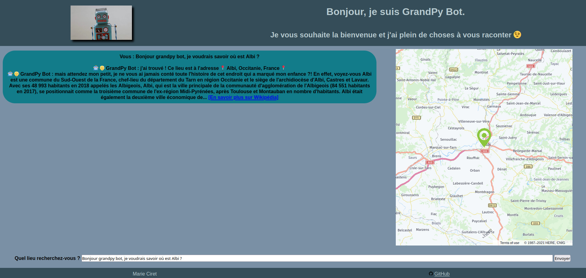
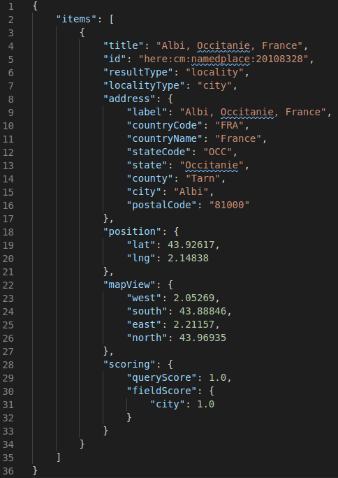
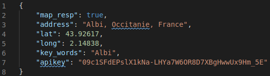
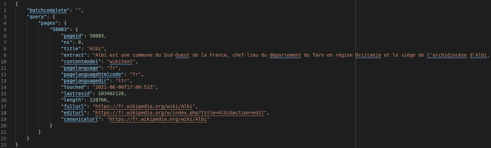
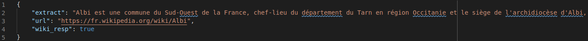

=====================
"GrandPy bot" project
=====================
**Searching for a spot address**

🔗 https://grandpybot.p7.mc-dapy.fr/

|Status badge| |UIlanguage badge|

*****************
TABLE OF CONTENTS
*****************

1. `DESCRIPTION`_
    * `Summary`_
    * `Feature and scenario`_

2. `INSTALLATION`_
    * `Steps`_
    * `Required libraries`_

3. `USAGE`_
    * `UI example`_
    * `API data`_

DESCRIPTION
===========

Summary
-------
User could ask (french only) for locating a place to user by entering a question in an text input field and submit it.

A robot (GrandPy Bot) parses (tiny NLP) user input and requests 2 API :

* HERE.com to get the address and pinned it on a map,
* Wikipedia to get infos article (intro + url are displayed).

Feature and scenario
--------------------
A user could asks GrandPy Bot a place name in order to obtain the address.

1) User asks GrandPy Bot a place name that is locatable by here.com and have a Wikipedia article.

    **Given** I am a user who is asking for a place address,

    **When** GrandPy Bot answers me,

    **Then** he displays a message informing me of the address, the start of Wikipedia article and its url and the here.com marked map.

2) User asks GrandPy Bot a place name that is not locatable by here.com.

    **Given** I am a user who is asking for a place address,

    **When** GrandPy Bot answers me,

    **Then** he displays a message informing me of incapacity to locate this place.

3) User asks GrandPy Bot a place name that is locatable by here.com but do not have a Wikipedia article.

    **Given** I am a user who is asking for a place address,

    **When** GrandPy Bot answers me,

    **Then** he displays a message informing me of the address and the here.com marked map.

INSTALLATION
============

Steps
-----

1) Download the project : use the "Code" (green button) and unzip the P7_GrandPyBot_DA-Python-master.zip file.
2) Python3 comes with Python Package Manager (pip) else you have to install it (https://pip.pypa.io/en/stable/installing/)

3) Set up a virtual environment :

    NB: the symbol $ flags the commands prompt

    * UNIX operating system :
        3.1) Install the Python module : $ pip install venv

        3.2) Navigate to the project main directory using command prompt : $ cd .....

        3.3) Create a virtual environment : $ python -m venv name_of_your_virtual_env

        3.4) Activate the virtual environment : $ source name_of_your_virtual_env/bin/activate

    * DOS operating system :
        3.1) Install the Python module : $ pip install venv

        3.2) Navigate to the project main directory using command prompt : $ cd .....

        3.3) Create a virtual environment : $ py -m venv name_of_your_virtual_env

        3.4) Activate the virtual environment : $ .\name_of_your_virtual_env\Scripts\activate

4) Install required libraries : see the Required libraries section below.

5) Environment variables to be set :

    * HERE_API_KEY = API key for here.com access (see "Freemium" account : https://developer.here.com/sign-up?create=Freemium-Basic&keepState=true&step=account)

6) Run the code source main.py file : (UNIX) python ./main.py (DOS) py main.py

7) Follow the http:// link given by Flask starting message on the terminal output (usually http://127.0.0.1:5000/) to display interface in your browser.

Required libraries
------------------
|vPython badge|
|vHTML badge| |vCSS badge| |JavaScript badge|

Python libraries to install in your virtual environment : $ pip install -r requirements.txt

USAGE
=====
UI example
----------

API data
--------

**Mapping with here.com:**

here.com API response (see UI example above for the submitted and parsed user question) :

here.com API response parsed by the back_end and returned to the front-end :

**Wikipedia infos :**

Wikipedia API response (see UI example above for the submitted and parsed user question) :

Wikipedia API response parsed by the back_end and returned to the front-end :

.. |vPython badge| image:: https://img.shields.io/badge/Python-3.9-blue.svg
.. |vHTML badge| image:: https://img.shields.io/badge/HTML-5-orange.svg
.. |vCSS badge| image:: https://img.shields.io/badge/CSS-3-blue.svg
.. |JavaScript badge| image:: https://img.shields.io/badge/JavaScript-.-yellow.svg

.. |Status badge| image:: https://img.shields.io/badge/Status-Production-brightgreen.svg
.. |UIlanguage badge| image:: https://img.shields.io/badge/UI-French-9cf.svg
